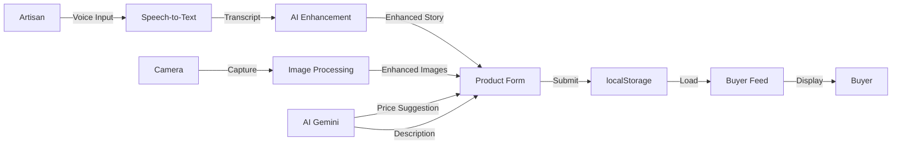
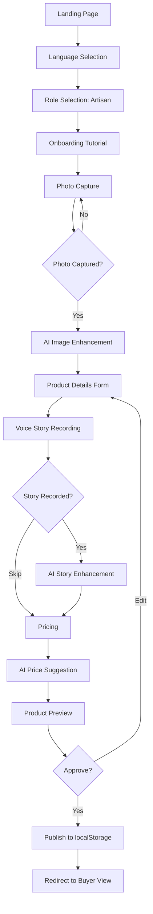
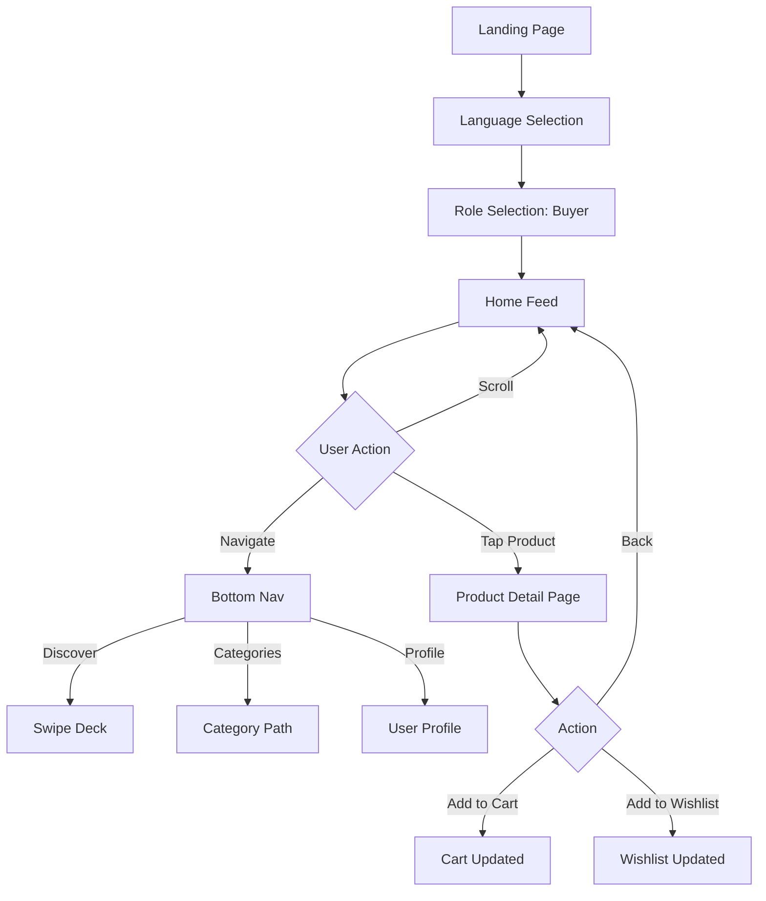
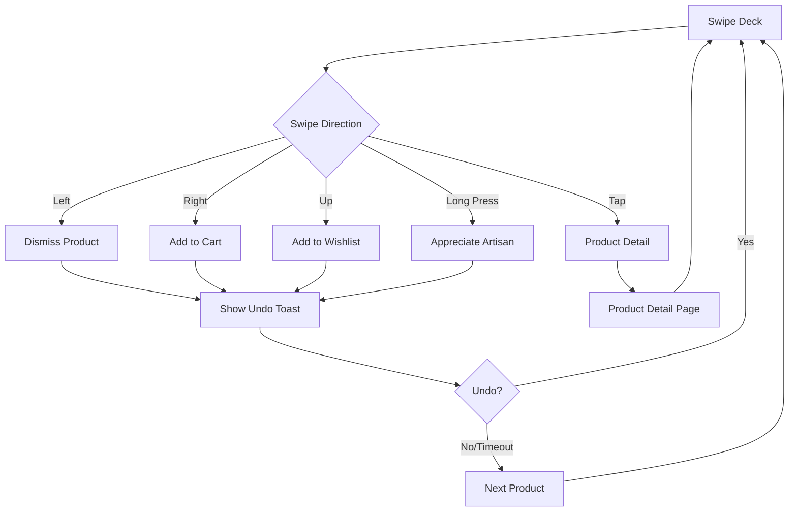
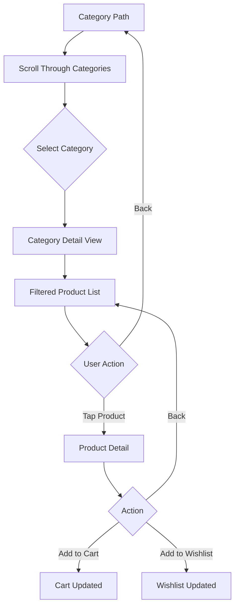
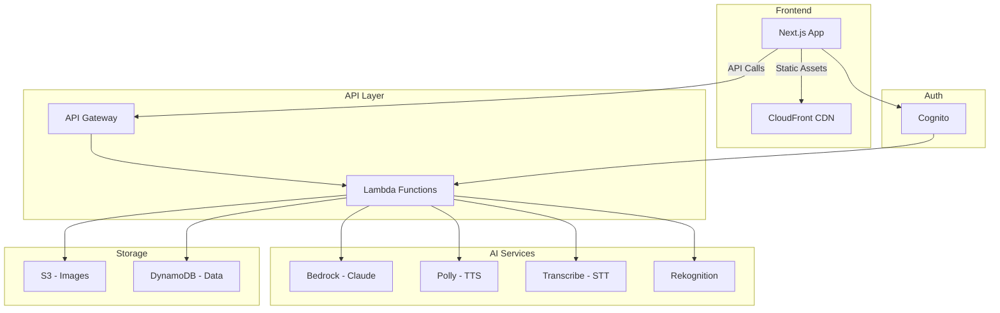

# Zariya - Design Document

## Table of Contents
1. [Design Philosophy](#1-design-philosophy)
2. [Architecture Overview](#2-architecture-overview)
3. [Technical Architecture](#3-technical-architecture)
4. [UI/UX Design System](#4-uiux-design-system)
5. [Key User Flows](#5-key-user-flows)
6. [Component Architecture](#6-component-architecture)
7. [Data Models](#7-data-models)
8. [Swipe Mechanics](#8-swipe-mechanics)
9. [Performance Considerations](#9-performance-considerations)
10. [Accessibility](#10-accessibility)
11. [AWS Migration Architecture](#11-aws-migration-architecture)

---

## 1. DESIGN PHILOSOPHY

### 1.1 Brand Personality

Zariya embodies a unique blend of traditional craftsmanship and modern technology:

- **Warm**: Inviting color palette inspired by Indian terracotta and earth tones
- **Culturally Sensitive**: Respects and celebrates traditional Indian crafts and artisan heritage
- **Elegant**: Premium marketplace aesthetic that elevates handcrafted products
- **Tactile**: Physical, touch-based interactions that mirror the handmade nature of products
- **Story-Driven**: Every product has a narrative, connecting buyers to artisans' journeys

### 1.2 Core Design Principle

**"Remove digital barriers through conversational AI"**

The platform is designed with the understanding that many traditional artisans have limited digital literacy. Every interaction is:
- Voice-first with visual feedback
- Guided with contextual instructions
- Forgiving of mistakes with undo capabilities
- Multilingual to support 9 Indian languages
- Progressive, revealing complexity gradually

### 1.3 Visual Language

**Premium Marketplace with Indian Cultural Elements**

- **Color Story**: Warm terracotta, amber gold, and cream beige evoke traditional pottery and craft materials
- **Typography**: Elegant serif for headlines (cultural heritage) paired with clean sans-serif for readability
- **Imagery**: High-quality product photography with AI enhancement
- **Patterns**: Subtle gradients and soft shadows create depth without overwhelming
- **Motion**: Smooth, natural animations that feel handcrafted, not mechanical


---

## 2. ARCHITECTURE OVERVIEW

### 2.1 Frontend Architecture

**Next.js 15 App Router Architecture**

```
zariya/
├── src/
│   ├── app/                    # Next.js App Router
│   │   ├── layout.tsx          # Root layout with fonts
│   │   ├── page.tsx            # Landing page
│   │   ├── role/               # Role selection
│   │   ├── artisan/            # Artisan flows
│   │   │   ├── layout.tsx      # Artisan layout with voice assistant
│   │   │   ├── onboarding/     # Tutorial/intro
│   │   │   └── new-product/    # Product listing wizard
│   │   ├── buyer/              # Buyer flows
│   │   │   ├── page.tsx        # Home feed
│   │   │   ├── demo/           # Swipe deck
│   │   │   └── product/[id]/   # Product details
│   │   └── api/                # API routes
│   │       ├── voice/story/    # Voice story processing
│   │       └── price/suggest/  # AI price suggestions
│   ├── components/             # React components
│   │   ├── ui/                 # Shadcn/ui primitives
│   │   ├── buyer/              # Buyer-specific components
│   │   ├── product/            # Product display components
│   │   └── icons/              # Custom icons
│   ├── lib/                    # Utilities
│   │   ├── utils.ts            # Helper functions
│   │   ├── firestore-schema.ts # Data models
│   │   └── image-processing.ts # Client-side image enhancement
│   └── ai/                     # AI integration
│       ├── genkit.ts           # Genkit configuration
│       └── flows/              # AI flows
│           ├── generate-product-details.ts
│           ├── text-to-speech.ts
│           └── enhance-and-cartoonize-image.ts
```

### 2.2 Component Structure

**Atomic Design Pattern**

```
Atoms (ui/)
  ├── Button, Input, Badge, Card
  ├── Avatar, Checkbox, Switch
  └── Toast, Dialog, Dropdown

Molecules (composed UI)
  ├── ProductCard (image + info)
  ├── CategoryNode (icon + label)
  └── VoiceRecorder (button + waveform)

Organisms (feature components)
  ├── ProductForm (multi-step wizard)
  ├── SwipeDeck (card stack + actions)
  ├── CategoryPath (scrollable journey)
  └── VoiceAssistant (floating guide)

Templates (page layouts)
  ├── ArtisanLayout (with voice assistant)
  ├── BuyerLayout (with bottom nav)
  └── RootLayout (global styles)

Pages (routes)
  ├── Landing, Role Selection
  ├── Artisan Onboarding, Product Listing
  └── Buyer Feed, Swipe Deck, Product Detail
```

### 2.3 State Management Approach

**React Hooks + Context API**

- **Local State**: `useState` for component-specific state
- **Form State**: React Hook Form with Zod validation
- **Shared State**: Context API for cross-component communication
  - `AssistantProvider`: Voice assistant messages
  - `ProductFormProvider`: Multi-step form state (minimal usage)
- **Persistent State**: localStorage for demo mode
  - Products: `zariya_products`
  - User preferences: language, role
  - Cart and wishlist data


### 2.4 Data Flow

**Artisan → localStorage → Buyer Display**



**Demo Mode Flow:**
1. Artisan captures photo → Client-side enhancement → Store in localStorage as base64
2. Artisan records story → Browser STT → AI enhancement → Store in localStorage
3. AI generates description and price → Store in localStorage
4. Buyer loads products from localStorage → Display in feed/swipe deck
5. Buyer actions (cart, wishlist) → Store in localStorage

**Production Flow (Future):**
1. Artisan uploads photo → S3 → CloudFront CDN
2. Artisan records story → Transcribe → Bedrock → DynamoDB
3. AI generates metadata → Store in DynamoDB
4. Buyer queries DynamoDB → Display products
5. Buyer actions → DynamoDB updates

### 2.5 File Organization

**Feature-Based Organization**

- **`app/`**: Route-based organization following Next.js conventions
- **`components/`**: Organized by feature (buyer, product, ui)
- **`lib/`**: Shared utilities and schemas
- **`ai/`**: AI-specific logic isolated for easy migration

---

## 3. TECHNICAL ARCHITECTURE

### 3.1 Frontend Stack

#### 3.1.1 Core Framework
- **Next.js 15.3.3**: React framework with App Router
  - Server Components for static content
  - Client Components for interactive features
  - API Routes for backend logic
  - Automatic code splitting and optimization
- **React 18.3.1**: UI library with concurrent features
- **TypeScript 5.x**: Type safety and developer experience

#### 3.1.2 UI Component Library
- **Shadcn/ui**: Unstyled, accessible component primitives
  - Built on Radix UI primitives
  - Fully customizable with Tailwind
  - Copy-paste component model (no npm dependency)
- **Radix UI**: Headless UI components
  - Accordion, Dialog, Dropdown, Popover, Select, Tabs, Toast, Tooltip
  - Full keyboard navigation
  - ARIA-compliant accessibility

#### 3.1.3 Styling System
- **Tailwind CSS 3.4.1**: Utility-first CSS framework
  - Custom color palette via CSS variables
  - Responsive design utilities
  - Dark mode support (prepared)
- **tailwindcss-animate**: Animation utilities
- **CSS Variables**: Theme customization
  ```css
  --primary: 16 70% 62%        /* #E07A5F - Terracotta */
  --background: 28 56% 91%     /* #F5E9DE - Cream */
  --accent: 47 88% 44%         /* #D4AC0D - Gold */
  ```


#### 3.1.4 Animation Library
- **Framer Motion 12.23.16**: Production-ready animation library
  - Declarative animations with `motion` components
  - Gesture recognition (drag, tap, hover)
  - Layout animations and transitions
  - Spring physics for natural movement
  - Performance optimized with GPU acceleration

### 3.2 AI Integration

#### 3.2.1 AI Framework
- **Genkit 1.14.1**: Firebase's AI orchestration framework
  - `@genkit-ai/googleai`: Google AI integration
  - `@genkit-ai/next`: Next.js integration
  - Flow-based AI workflows
  - Structured output with Zod schemas

#### 3.2.2 AI Model
- **Google Gemini 1.5 Flash**: Multimodal AI model
  - Text generation for product descriptions
  - Story enhancement and polishing
  - Price suggestions based on product details
  - Image understanding (future)

#### 3.2.3 AI Flows
```typescript
// Product Details Generation
generateProductDetails({
  title, category, dimensions, price, story
}) → {
  description: string,
  suggestedPrice: number,
  craftStory: string
}

// Text-to-Speech
textToSpeech({
  text: string
}) → {
  audio: base64AudioData
}

// Image Enhancement (future)
enhanceAndCartoonizeImage({
  imageData: base64
}) → {
  enhanced: base64,
  cartoon: base64
}
```

### 3.3 Voice Services

#### 3.3.1 Speech-to-Text
- **Browser Web Speech API**: Native browser STT
  - `webkitSpeechRecognition` / `SpeechRecognition`
  - Real-time transcription
  - Language-specific recognition
  - Continuous listening mode
  - No server costs for demo

#### 3.3.2 Text-to-Speech
- **Primary**: Browser `speechSynthesis` API
  - Native browser TTS
  - Configurable rate, pitch, volume
  - Language-specific voices
  - Zero latency, no server costs
- **Fallback**: AI-generated audio via Genkit
  - Used when browser TTS unavailable
  - Higher quality but slower

#### 3.3.3 Voice Assistant Implementation
```typescript
// Voice Assistant Context
AssistantProvider {
  assistantMessage: string,
  setAssistantMessage: (msg: string) => void
}

// Usage in components
const { setAssistantMessage } = useAssistantContext();
setAssistantMessage("Let's capture your product photo...");

// Voice output with retry
speechSynthesis.speak(utterance);
// Fallback to AI audio if needed
```

### 3.4 Data Layer

#### 3.4.1 Demo Mode (Current)
- **localStorage**: Browser-based persistence
  - Products: JSON array of product objects
  - User preferences: language, role selection
  - Cart/wishlist: Product ID arrays
  - Quota: ~5-10MB per domain

#### 3.4.2 Data Validation
- **Zod**: TypeScript-first schema validation
  - Form validation with React Hook Form
  - API request/response validation
  - Type inference for TypeScript


#### 3.4.3 Image Handling
- **Next.js Image Component**: Automatic optimization
  - Lazy loading with placeholders
  - Responsive images with `srcset`
  - WebP/AVIF format conversion
  - Remote pattern allowlist for security
- **Client-Side Processing**: Canvas API for enhancement
  - Brightness/contrast adjustment
  - Sharpness filters
  - Cartoon effect generation
  - Fallback when AI unavailable

---

## 4. UI/UX DESIGN SYSTEM

### 4.1 Color Palette

#### 4.1.1 Primary Colors
```css
/* Terracotta - Primary Brand Color */
--primary: hsl(16, 70%, 62%)           /* #E07A5F */
--primary-foreground: hsl(16, 30%, 98%) /* Off-white text */

/* Warm Orange Gradients */
from-orange-600 to-red-600             /* Hero gradients */
from-amber-500 to-orange-600           /* Button gradients */
from-amber-50 to-orange-50             /* Background gradients */
```

#### 4.1.2 Background Colors
```css
/* Cream/Beige - Main Background */
--background: hsl(28, 56%, 91%)        /* #F5E9DE */
--card: hsl(28, 50%, 95%)              /* Lighter for cards */

/* Gradient Backgrounds */
bg-gradient-to-br from-amber-50 via-white to-orange-50
bg-gradient-to-br from-white to-amber-50/30
```

#### 4.1.3 Accent Colors
```css
/* Soft Gold - Highlights */
--accent: hsl(47, 88%, 44%)            /* #D4AC0D */
--accent-foreground: hsl(47, 90%, 10%) /* Dark text on gold */

/* Secondary Accents */
Blue-Cyan: from-blue-500 to-cyan-500   /* Buyer role */
Green-Emerald: from-green-500 to-emerald-500 /* Success */
Red-Pink: from-red-500 to-pink-500     /* Dismiss/error */
Yellow-Amber: from-yellow-500 to-amber-500 /* Wishlist */
```

#### 4.1.4 Text Colors
```css
/* Dark Brown/Black */
--foreground: hsl(20, 14%, 4%)         /* #14110F - Primary text */
text-gray-800                          /* Headings */
text-gray-700                          /* Body text */
text-gray-600                          /* Secondary text */
text-gray-500                          /* Captions */
```

#### 4.1.5 Semantic Colors
```css
/* Success */
bg-green-500, text-green-700, border-green-200

/* Warning */
bg-yellow-500, text-yellow-700, border-yellow-200

/* Error */
bg-red-500, text-red-700, border-red-200

/* Info */
bg-blue-500, text-blue-700, border-blue-200
```

### 4.2 Typography

#### 4.2.1 Font Family
```css
/* Primary Font - PT Sans */
font-family: 'PT Sans', sans-serif;

/* Usage */
font-body: ['PT Sans', 'sans-serif']     /* Body text */
font-headline: ['PT Sans', 'sans-serif'] /* Headings */
font-code: ['monospace']                 /* Code blocks */
```

**PT Sans Characteristics:**
- Humanist sans-serif with warmth
- Excellent readability at small sizes
- Supports Latin and Cyrillic scripts
- 4 weights: Regular (400), Italic, Bold (700), Bold Italic

#### 4.2.2 Font Sizes
```css
/* Display - Hero Headings */
text-6xl: 96px / 6rem    /* Landing page hero */
text-5xl: 72px / 4.5rem  /* Section heroes */
text-4xl: 48px / 3rem    /* Page titles */
text-3xl: 36px / 2.25rem /* Large headings */

/* Headings */
text-2xl: 24px / 1.5rem  /* Section titles */
text-xl: 20px / 1.25rem  /* Card titles */
text-lg: 18px / 1.125rem /* Subheadings */

/* Body */
text-base: 16px / 1rem   /* Default body text */
text-sm: 14px / 0.875rem /* Small text */
text-xs: 12px / 0.75rem  /* Captions, labels */
```

#### 4.2.3 Font Weights
```css
font-bold: 700       /* Headings, emphasis */
font-semibold: 600   /* Subheadings */
font-medium: 500     /* Buttons, labels */
font-normal: 400     /* Body text */
```

#### 4.2.4 Line Heights
```css
leading-tight: 1.25   /* Headings */
leading-snug: 1.375   /* Subheadings */
leading-normal: 1.5   /* Body text */
leading-relaxed: 1.625 /* Long-form content */
```


### 4.3 Component Patterns

#### 4.3.1 Cards
```css
/* Standard Card */
rounded-2xl                    /* 16px border radius */
shadow-2xl                     /* Large shadow for depth */
border-0                       /* No border, shadow only */
bg-gradient-to-br from-white to-amber-50/30

/* Hover Effect */
hover:shadow-3xl               /* Deeper shadow */
hover:scale-105                /* Slight lift */
transition-all duration-300    /* Smooth transition */

/* Product Card Specific */
rounded-3xl                    /* 24px for larger cards */
overflow-hidden                /* Clip image */
border border-gray-200         /* Subtle border */
```

#### 4.3.2 Buttons
```css
/* Primary Button */
bg-gradient-to-r from-amber-600 to-orange-600
text-white
px-8 py-3                      /* Generous padding */
rounded-xl                     /* 12px radius */
font-medium
shadow-lg

/* Hover State */
hover:from-amber-700 hover:to-orange-700
hover:shadow-xl
transition-all duration-200

/* Active State */
active:scale-95                /* Press feedback */

/* Icon Button */
w-12 h-12                      /* Fixed size */
rounded-full                   /* Circular */
flex items-center justify-center
```

#### 4.3.3 Badges
```css
/* Category Badge */
rounded-full
px-4 py-2
bg-gradient-to-br from-{color}-500 to-{color}-600
text-white
text-sm font-medium
shadow-lg

/* Status Badge */
w-8 h-8 rounded-full
flex items-center justify-center
bg-gradient-to-br from-green-500 to-emerald-500

/* Trending Badge */
bg-gradient-to-br from-orange-500 to-red-500
```

#### 4.3.4 Input Fields
```css
/* Text Input */
h-12                           /* Consistent height */
text-lg                        /* Readable size */
border-2 border-gray-200
focus:border-amber-400         /* Accent on focus */
rounded-xl
px-4 py-3

/* Textarea */
text-lg
border-2 border-gray-200
focus:border-amber-400
rounded-xl
resize-none                    /* Fixed size */
```

### 4.4 Spacing System

#### 4.4.1 Base Unit
```css
/* 4px base unit (0.25rem) */
Space Scale: 0, 1, 2, 3, 4, 6, 8, 12, 16, 20, 24, 32, 40, 48, 64, 80, 96

/* Common Patterns */
gap-4: 16px                    /* Component spacing */
gap-6: 24px                    /* Section spacing */
gap-8: 32px                    /* Large spacing */

p-4: 16px                      /* Card padding */
p-6: 24px                      /* Modal padding */
p-8: 32px                      /* Page padding */

mb-4: 16px                     /* Element margin */
mb-8: 32px                     /* Section margin */
mb-12: 48px                    /* Large section margin */
```

#### 4.4.2 Container Widths
```css
max-w-7xl: 1280px              /* Page container */
max-w-4xl: 896px               /* Content container */
max-w-2xl: 672px               /* Text container */
max-w-sm: 384px                /* Card container */
```

### 4.5 Border Radius

```css
rounded-sm: 2px                /* Subtle rounding */
rounded: 4px                   /* Default */
rounded-md: 6px                /* Medium */
rounded-lg: 8px                /* Large */
rounded-xl: 12px               /* Extra large */
rounded-2xl: 16px              /* Cards */
rounded-3xl: 24px              /* Product cards */
rounded-full: 9999px           /* Circular */
```

### 4.6 Shadows

```css
/* Elevation System */
shadow-sm: 0 1px 2px rgba(0,0,0,0.05)           /* Subtle */
shadow: 0 1px 3px rgba(0,0,0,0.1)               /* Default */
shadow-md: 0 4px 6px rgba(0,0,0,0.1)            /* Medium */
shadow-lg: 0 10px 15px rgba(0,0,0,0.1)          /* Large */
shadow-xl: 0 20px 25px rgba(0,0,0,0.15)         /* Extra large */
shadow-2xl: 0 25px 50px rgba(0,0,0,0.25)        /* Maximum */

/* Usage */
Cards: shadow-2xl
Buttons: shadow-lg
Dropdowns: shadow-xl
Modals: shadow-2xl
```

### 4.7 Iconography

#### 4.7.1 Icon Library
- **Lucide React**: Consistent, beautiful icons
- **Style**: Outline/stroke icons
- **Sizes**: 16px, 20px, 24px, 32px, 48px
- **Stroke Width**: 2px (default)

#### 4.7.2 Common Icons
```typescript
// Navigation
Home, ShoppingBag, User, Heart, Search

// Actions
Camera, Mic, Upload, Download, Share, Edit, Trash

// Status
Check, X, AlertCircle, Info, Star, TrendingUp

// Gestures
ArrowLeft, ArrowRight, ChevronDown, Plus, Minus

// Categories
Palette, Shirt, Footprints, Scissors, Sparkles, Gem
```

#### 4.7.3 Custom Icons
- **ArtisanIcon**: Hand-drawn pottery/craft symbol
- **BuyerIcon**: Shopping bag with heart
- **CameraIcon**: Simplified camera outline


### 4.8 Animation Principles

#### 4.8.1 Timing Functions
```css
/* Easing */
ease-in-out: cubic-bezier(0.4, 0, 0.2, 1)  /* Default */
ease-out: cubic-bezier(0, 0, 0.2, 1)       /* Entrances */
ease-in: cubic-bezier(0.4, 0, 1, 1)        /* Exits */

/* Spring Physics (Framer Motion) */
spring: { stiffness: 300, damping: 30 }    /* Natural movement */
```

#### 4.8.2 Duration
```css
duration-200: 200ms            /* Quick feedback */
duration-300: 300ms            /* Standard transition */
duration-500: 500ms            /* Smooth animation */
duration-700: 700ms            /* Slow, dramatic */
```

#### 4.8.3 Animation Types
```typescript
// Fade
initial={{ opacity: 0 }}
animate={{ opacity: 1 }}
exit={{ opacity: 0 }}

// Slide
initial={{ y: 20, opacity: 0 }}
animate={{ y: 0, opacity: 1 }}

// Scale
whileHover={{ scale: 1.05 }}
whileTap={{ scale: 0.95 }}

// Rotate
animate={{ rotate: [0, 5, -5, 0] }}

// Stagger Children
staggerChildren: 0.1
```

---

## 5. KEY USER FLOWS

### 5.1 Artisan Product Listing Flow



**Step-by-Step Breakdown:**

1. **Landing** → User arrives at homepage
2. **Language Selection** → Choose from 9 Indian languages + English
3. **Role Selection** → Select "I'm an Artisan"
4. **Onboarding Tutorial** → Short video/reel explaining process
5. **Photo Capture** → 
   - Camera access or file upload
   - Voice guidance: "Position item in center", "Get lighting right"
   - Capture button when ready
6. **AI Enhancement** →
   - Original, Enhanced, Cartoon versions generated
   - Loading state with progress indicator
7. **Product Details** →
   - Title (required)
   - Category dropdown (required)
   - Dimensions (required)
   - Description (optional, can be AI-generated)
8. **Voice Story** →
   - Microphone button to record
   - Real-time transcription display
   - AI enhancement of story
   - Manual editing allowed
9. **Pricing** →
   - Manual price input
   - "Suggest Price" button for AI recommendation
   - Rationale displayed
10. **Preview** →
    - Full product card preview
    - Edit any section
    - Publish button
11. **Publish** →
    - Save to localStorage
    - Success toast
    - Redirect to buyer marketplace

**Voice Assistant Messages:**
- Photos: "Let's start with a great photo. Position your item in the center."
- Details: "Looking great! Now, tell me a bit about your piece."
- Story: "Perfect! Now let's capture the story behind your creation."
- Pricing: "We are almost done. What is the price you want to set?"
- Review: "Everything looks perfect! Just give it one last look."


### 5.2 Buyer Discovery Flow

#### 5.2.1 Home Feed Flow



#### 5.2.2 Swipe Deck Flow



**Swipe Mechanics:**
- **Left Swipe** (Dismiss): Red overlay with X icon
- **Right Swipe** (Cart): Green overlay with shopping cart icon
- **Up Swipe** (Wishlist): Yellow overlay with star icon
- **Long Press** (Appreciate): Pink overlay with heart icon
- **Tap**: Navigate to product detail page

**Visual Feedback:**
- Direction indicator during swipe
- Rotation and scale animation
- Color overlay matching action
- Undo toast with 5-second window

#### 5.2.3 Category Path Flow



**Category Path Features:**
- Duolingo-style visual journey
- 17 craft categories with unique icons
- Level badges and completion status
- Trending indicators
- Artisan and product counts
- Smooth scroll animations
- Progress tracking

---

## 6. COMPONENT ARCHITECTURE

### 6.1 Artisan Components

#### 6.1.1 ProductForm
**Location**: `src/app/artisan/new-product/_components/product-form.tsx`

**Purpose**: Multi-step wizard for product listing

**State Management**:
```typescript
const [step, setStep] = useState('photos');
const [images, setImages] = useState({
  original: null,
  enhanced: null,
  cartoon: null
});
const form = useForm<ProductFormValues>({
  resolver: zodResolver(productSchema)
});
```

**Steps**:
1. `photos` - Camera capture or upload
2. `details` - Title, category, dimensions
3. `story` - Voice recording or text input
4. `pricing` - Price input with AI suggestion
5. `shipping` - Shipping address (future)
6. `billing` - Payment info (future)
7. `review` - Final preview before publish

**Key Features**:
- Step-by-step navigation with back/next
- Form validation with Zod
- AI enhancement buttons
- Real-time preview
- Voice assistant integration


#### 6.1.2 VoiceStoryRecorder
**Location**: `src/app/artisan/new-product/_components/voice-story-recorder.tsx`

**Purpose**: Record and transcribe artisan's product story

**Features**:
- Microphone button with visual feedback
- Real-time transcription using Web Speech API
- Waveform animation during recording
- Stop/restart controls
- AI enhancement of transcript
- Manual editing capability

**State**:
```typescript
const [isRecording, setIsRecording] = useState(false);
const [transcript, setTranscript] = useState('');
const [isProcessing, setIsProcessing] = useState(false);
```

**API Integration**:
```typescript
POST /api/voice/story
{
  productId: string,
  transcript: string,
  language: string
}
→ {
  craft_story: string,
  short_description: string
}
```

#### 6.1.3 CameraCapture
**Location**: `src/app/artisan/new-product/_components/camera-capture.tsx`

**Purpose**: Capture product photos using device camera

**Features**:
- Live camera feed preview
- Capture button with animation
- Front/back camera toggle
- Flash control
- Aspect ratio guidance overlay
- Error handling for camera access

**Implementation**:
```typescript
const videoRef = useRef<HTMLVideoElement>(null);
const canvasRef = useRef<HTMLCanvasElement>(null);

// Access camera
navigator.mediaDevices.getUserMedia({ video: true })

// Capture frame
const canvas = canvasRef.current;
const context = canvas.getContext('2d');
context.drawImage(videoRef.current, 0, 0);
const dataUrl = canvas.toDataURL('image/jpeg');
```

#### 6.1.4 VoiceAssistant
**Location**: `src/app/artisan/_components/voice-assistant.tsx`

**Purpose**: Floating voice guide providing contextual instructions

**Features**:
- Typing animation for text display
- Text-to-speech audio playback
- Mute/unmute control
- Contextual messages per step
- Retry mechanism for audio playback
- Auto-enable after user interaction

**UI**:
```typescript
<div className="fixed bottom-4 right-4 z-50">
  <div className="rounded-lg bg-card/80 backdrop-blur-sm">
    <button onClick={handleMuteToggle}>
      {isMuted ? <VolumeX /> : <Volume2 />}
    </button>
    <p>{displayedMessage}</p>
  </div>
</div>
```

### 6.2 Buyer Components

#### 6.2.1 HomeFeed
**Location**: `src/components/buyer/HomeFeed.tsx`

**Purpose**: Grid display of trending and curated products

**Features**:
- Responsive grid layout (1-3 columns)
- Product cards with hover effects
- Infinite scroll (future)
- Filter and sort options (future)
- Loading skeletons

**Layout**:
```typescript
<div className="grid grid-cols-1 md:grid-cols-2 lg:grid-cols-3 gap-6">
  {products.map(product => (
    <ProductCard key={product.id} product={product} />
  ))}
</div>
```

#### 6.2.2 SwipeDeck
**Location**: `src/components/buyer/SwipeDeck.tsx`

**Purpose**: Tinder-style swipeable product discovery

**Features**:
- Stacked card layout with depth effect
- Drag gesture recognition
- Swipe direction detection
- Action buttons as alternative to swiping
- Undo functionality with toast
- Smooth card transitions

**State**:
```typescript
const [currentIndex, setCurrentIndex] = useState(0);
const [lastAction, setLastAction] = useState(null);
const [swipeDirection, setSwipeDirection] = useState(null);
```

**Gesture Handling**:
```typescript
<motion.div
  drag
  dragConstraints={{ left: 0, right: 0, top: 0, bottom: 0 }}
  onDragEnd={(_, info) => {
    const { x, y } = info.offset;
    if (x > 100) onSwipeRight();
    else if (x < -100) onSwipeLeft();
    else if (y < -100) onSwipeUp();
  }}
>
```


#### 6.2.3 CategoryPath
**Location**: `src/components/buyer/CategoryPath.tsx`

**Purpose**: Duolingo-style visual journey through craft categories

**Features**:
- Curved scrollable path connecting categories
- 17 category nodes with unique styling
- Level badges and completion indicators
- Trending badges for popular categories
- Lock icons for future gamification
- Smooth scroll animations
- Progress tracking

**Category Node Structure**:
```typescript
interface CategoryNode {
  id: string;
  name: string;
  icon: React.ComponentType;
  color: string;
  gradient: string;
  level: number;
  isLocked: boolean;
  isCompleted: boolean;
  isTrending: boolean;
  description: string;
  artisanCount: number;
  productCount: number;
  position: 'left' | 'right';
}
```

**Visual Design**:
- SVG path connecting all nodes
- Gradient coloring for path
- Alternating left/right node positions
- Glow effects for active nodes
- Smooth scroll reveal animations

#### 6.2.4 ProductCard
**Location**: `src/components/buyer/ProductCard.tsx`

**Purpose**: Reusable product display card

**Features**:
- Product image with gradient overlay
- Title, artisan, location, price
- Rating badge
- Handcrafted badge
- Hover and tap animations
- Long-press gesture for appreciation
- Drag gesture for swiping

**Layout**:
```typescript
<motion.div className="rounded-3xl overflow-hidden">
  {/* Product Image */}
  <Image src={product.image} fill />
  
  {/* Top Section - Title */}
  <div className="absolute top-4 left-4">
    <div className="bg-white/90 backdrop-blur-sm rounded-2xl">
      <h3>{product.title}</h3>
      <span>Handcrafted</span>
    </div>
  </div>
  
  {/* Rating Badge */}
  <div className="absolute top-4 right-4">
    <div className="bg-orange-500 rounded-full">
      <Star /> {product.rating}
    </div>
  </div>
  
  {/* Bottom Section - Info */}
  <div className="absolute bottom-4 left-4 right-4">
    <div className="bg-white/90 backdrop-blur-sm rounded-2xl">
      <p>{product.description}</p>
      <div className="flex justify-between">
        <div>
          <p>{product.artisan}</p>
          <p>{product.location}</p>
        </div>
        <p>₹{product.price}</p>
      </div>
    </div>
  </div>
</motion.div>
```

#### 6.2.5 ProductDetail
**Location**: `src/components/buyer/ProductDetail.tsx`

**Purpose**: Full product information page

**Components**:
- **HeroImage**: Large image carousel
- **MetaBadges**: Category, handcrafted, verified badges
- **PriceCard**: Price, rating, availability
- **StoryCard**: Full craft story with artisan info
- **TagList**: Product tags/keywords
- **StickyActions**: Fixed bottom bar with cart/wishlist buttons

**Layout Structure**:
```typescript
<div className="min-h-screen">
  <HeroImage images={product.images} />
  <div className="max-w-4xl mx-auto px-4">
    <MetaBadges category={product.category} />
    <h1>{product.title}</h1>
    <PriceCard price={product.price} rating={product.rating} />
    <StoryCard story={product.story} artisan={product.artisan} />
    <TagList tags={product.tags} />
  </div>
  <StickyActions onAddToCart={...} onAddToWishlist={...} />
</div>
```

#### 6.2.6 BottomNav
**Location**: `src/components/buyer/BottomNav.tsx`

**Purpose**: Fixed bottom navigation for mobile

**Tabs**:
- Home (feed icon)
- Discover (swipe icon)
- Categories (grid icon)
- Profile (user icon)

**Features**:
- Active state highlighting
- Badge counters for cart/wishlist
- Smooth tab transitions
- Sticky positioning

### 6.3 Shared Components

#### 6.3.1 UI Primitives (Shadcn/ui)
**Location**: `src/components/ui/`

**Components**:
- **Button**: Primary, secondary, outline, ghost variants
- **Card**: Container with header, content, footer
- **Input**: Text, number, email, password
- **Textarea**: Multi-line text input
- **Select**: Dropdown selection
- **Badge**: Status indicators
- **Toast**: Notification system
- **Dialog**: Modal dialogs
- **Form**: Form field wrappers with validation

**Usage Pattern**:
```typescript
import { Button } from '@/components/ui/button';
import { Card, CardHeader, CardContent } from '@/components/ui/card';

<Card>
  <CardHeader>
    <CardTitle>Product Details</CardTitle>
  </CardHeader>
  <CardContent>
    <Button variant="default">Submit</Button>
  </CardContent>
</Card>
```


---

## 7. DATA MODELS

### 7.1 Product Schema

```typescript
interface Product {
  // Identity
  id: string;                    // Unique identifier
  artisan_id: string;            // Reference to artisan
  
  // Basic Info
  title: string;                 // Product name
  category: string;              // Craft category
  dimensions: string;            // Size/dimensions
  
  // Pricing
  price: number;                 // Final price (INR)
  suggested_price?: number;      // AI-suggested price
  price_rationale?: string;      // AI explanation
  
  // Content
  story?: string;                // Full craft story
  description?: string;          // Short description
  craft_story_id?: string;       // Reference to AI asset
  short_description?: string;    // Marketing copy
  
  // Media
  images: {
    original: string;            // Original photo (base64 or URL)
    enhanced?: string;           // AI-enhanced version
    cartoon?: string;            // Artistic style version
    quality?: {
      brightness?: number;
      blur_score?: number;
    };
  };
  
  // Metadata
  tags: string[];                // Keywords/tags
  status: 'draft' | 'published' | 'sold' | 'reserved';
  
  // Display Info (for buyer view)
  artisan: string;               // Artisan name
  location: string;              // Location string
  rating?: number;               // Product rating (0-5)
  
  // Timestamps
  created_at: string;            // ISO 8601 timestamp
  updated_at: string;            // ISO 8601 timestamp
  
  // Future
  shipping_address?: Address;
  views?: number;
  likes?: number;
}
```

### 7.2 AI Asset Schema

```typescript
interface AIAsset {
  id: string;
  type: 'story' | 'hashtags' | 'image_enhancement' | 'price_suggestion';
  product_id: string;
  
  // Content
  generated_text?: string;       // AI-generated text
  transcript?: string;           // Original voice transcript
  
  // Metadata
  is_edited_by_artisan: boolean; // Manual edits made
  created_at: string;
  updated_at: string;
  metadata?: Record<string, any>;
}
```

### 7.3 User Preferences

```typescript
interface UserPreferences {
  language: string;              // Selected language code
  role: 'artisan' | 'buyer';     // User role
  theme?: 'light' | 'dark';      // Theme preference
  notifications_enabled?: boolean;
}

// localStorage key: 'zariya_preferences'
```

### 7.4 Cart Schema

```typescript
interface CartItem {
  product_id: string;
  quantity: number;
  added_at: string;
}

interface Cart {
  items: CartItem[];
  updated_at: string;
}

// localStorage key: 'zariya_cart'
```

### 7.5 Wishlist Schema

```typescript
interface Wishlist {
  product_ids: string[];
  updated_at: string;
}

// localStorage key: 'zariya_wishlist'
```

### 7.6 Voice Session Schema (Future)

```typescript
interface VoiceSession {
  id: string;
  artisan_id: string;
  product_id?: string;
  
  // State
  state: 'photos' | 'story' | 'pricing' | 'trends' | 
         'shipping' | 'billing' | 'review' | 'published';
  
  // Collected Data
  slots: {
    title?: string;
    images?: string[];
    story_text?: string;
    suggested_price?: number;
    tags?: string[];
    shipping_address?: any;
  };
  
  created_at: string;
  updated_at: string;
}
```

### 7.7 Order Schema (Future)

```typescript
interface Order {
  id: string;
  product_id: string;
  buyer_id: string;
  
  // Transaction
  price: number;
  status: 'pending' | 'paid' | 'cancelled' | 'refunded';
  payment_intent_id?: string;
  
  // Timestamps
  created_at: string;
  updated_at: string;
}
```

---

## 8. SWIPE MECHANICS

### 8.1 Gesture Recognition

#### 8.1.1 Swipe Directions

```typescript
// Threshold for swipe detection
const SWIPE_THRESHOLD = 100; // pixels

onDragEnd={(_, info) => {
  const { x, y } = info.offset;
  
  // Determine primary direction
  if (Math.abs(x) > Math.abs(y)) {
    // Horizontal swipe
    if (x > SWIPE_THRESHOLD) {
      handleSwipeRight(); // Add to cart
    } else if (x < -SWIPE_THRESHOLD) {
      handleSwipeLeft(); // Dismiss
    }
  } else {
    // Vertical swipe
    if (y < -SWIPE_THRESHOLD) {
      handleSwipeUp(); // Add to wishlist
    }
  }
}
```

#### 8.1.2 Long Press Detection

```typescript
const longPressTimer = useRef<NodeJS.Timeout>();

const handlePointerDown = () => {
  longPressTimer.current = setTimeout(() => {
    handleLongPress(); // Appreciate artisan
  }, 500); // 500ms threshold
};

const handlePointerUp = () => {
  if (longPressTimer.current) {
    clearTimeout(longPressTimer.current);
  }
};
```

### 8.2 Visual Feedback

#### 8.2.1 Swipe Overlays

```typescript
// Direction-specific overlays
{swipeDirection === 'left' && (
  <div className="absolute inset-0 bg-red-500/20">
    <X className="w-20 h-20 text-white" />
  </div>
)}

{swipeDirection === 'right' && (
  <div className="absolute inset-0 bg-green-500/20">
    <ShoppingCart className="w-20 h-20 text-white" />
  </div>
)}

{swipeDirection === 'up' && (
  <div className="absolute inset-0 bg-yellow-500/20">
    <Star className="w-20 h-20 text-white" />
  </div>
)}
```

#### 8.2.2 Card Animations

```typescript
// Card stack effect
const visibleProducts = products.slice(currentIndex, currentIndex + 3);

visibleProducts.map((product, index) => {
  const zIndex = 10 - index;
  const scale = 1 - index * 0.05;
  const yOffset = index * 8;
  const rotation = index * 1.5;
  
  return (
    <motion.div
      style={{ zIndex, scale, y: yOffset, rotate: rotation }}
      exit={{
        x: -500,
        rotate: -15,
        opacity: 0
      }}
    />
  );
});
```


### 8.3 Action Buttons

```typescript
// Alternative to swiping
<div className="flex items-center gap-4">
  {/* Dismiss */}
  <button onClick={() => handleSwipe('left')} 
          className="w-12 h-12 bg-red-500 rounded-full">
    <X className="w-6 h-6 text-white" />
  </button>
  
  {/* Appreciate */}
  <button onPointerDown={startLongPress}
          onPointerUp={cancelLongPress}
          className="w-12 h-12 bg-pink-500 rounded-full">
    <Heart className="w-6 h-6 text-white" />
  </button>
  
  {/* Wishlist */}
  <button onClick={() => handleSwipe('up')}
          className="w-12 h-12 bg-yellow-500 rounded-full">
    <Star className="w-6 h-6 text-white" />
  </button>
  
  {/* Add to Cart */}
  <button onClick={() => handleSwipe('right')}
          className="w-12 h-12 bg-green-500 rounded-full">
    <ShoppingCart className="w-6 h-6 text-white" />
  </button>
</div>
```

### 8.4 Undo Functionality

```typescript
// Toast with undo button
<ActionToast
  action={lastAction?.action}
  onUndo={() => {
    setCurrentIndex(prev => Math.max(0, prev - 1));
    setLastAction(null);
  }}
  showUndo={!!lastAction}
/>

// Auto-dismiss after 5 seconds
useEffect(() => {
  if (showToast) {
    const timer = setTimeout(() => {
      setShowToast(false);
      setLastAction(null);
    }, 5000);
    return () => clearTimeout(timer);
  }
}, [showToast]);
```

---

## 9. PERFORMANCE CONSIDERATIONS

### 9.1 Image Optimization

#### 9.1.1 Next.js Image Component
```typescript
<Image
  src={product.image}
  alt={product.title}
  fill
  className="object-cover"
  priority={isActive}              // Preload active card
  sizes="(max-width: 768px) 100vw, 400px"
  placeholder="blur"               // Blur placeholder
  blurDataURL={generateBlurDataURL(product.image)}
/>
```

#### 9.1.2 Remote Pattern Configuration
```typescript
// next.config.ts
images: {
  remotePatterns: [
    { protocol: 'https', hostname: 'placehold.co' },
    { protocol: 'https', hostname: 'images.unsplash.com' },
    { protocol: 'https', hostname: 'picsum.photos' }
  ]
}
```

#### 9.1.3 Base64 Encoding for Demo
```typescript
// Store images as base64 in localStorage
const reader = new FileReader();
reader.onload = (event) => {
  const dataUrl = event.target?.result as string;
  setImages({ original: dataUrl });
};
reader.readAsDataURL(file);
```

### 9.2 Lazy Loading

#### 9.2.1 Component Lazy Loading
```typescript
import dynamic from 'next/dynamic';

const SwipeDeck = dynamic(() => import('@/components/buyer/SwipeDeck'), {
  loading: () => <LoadingSkeleton />,
  ssr: false
});
```

#### 9.2.2 Product Card Lazy Loading
```typescript
// Load products in batches
const [visibleProducts, setVisibleProducts] = useState(
  products.slice(0, 12)
);

// Infinite scroll
const loadMore = () => {
  setVisibleProducts(prev => [
    ...prev,
    ...products.slice(prev.length, prev.length + 12)
  ]);
};
```

### 9.3 Swipe Deck Optimization

#### 9.3.1 Preload Next Cards
```typescript
// Only render visible cards (current + next 2)
const visibleProducts = products.slice(currentIndex, currentIndex + 3);

// Preload images for next cards
useEffect(() => {
  visibleProducts.forEach(product => {
    const img = new Image();
    img.src = product.image;
  });
}, [currentIndex]);
```

#### 9.3.2 GPU Acceleration
```typescript
// Use transform instead of position
<motion.div
  style={{
    transform: `translateY(${yOffset}px) scale(${scale}) rotate(${rotation}deg)`
  }}
/>

// Enable hardware acceleration
className="transform-gpu will-change-transform"
```

### 9.4 Animation Performance

#### 9.4.1 60fps Target
```typescript
// Use Framer Motion's optimized animations
<motion.div
  animate={{ x: 0, y: 0 }}
  transition={{
    type: "spring",
    stiffness: 300,
    damping: 30
  }}
/>

// Avoid layout thrashing
// ✅ Good: transform, opacity
// ❌ Bad: width, height, top, left
```

#### 9.4.2 Reduced Motion
```typescript
// Respect user preferences
const prefersReducedMotion = window.matchMedia(
  '(prefers-reduced-motion: reduce)'
).matches;

<motion.div
  animate={prefersReducedMotion ? {} : { scale: 1.05 }}
/>
```

### 9.5 localStorage Management

#### 9.5.1 Quota Management
```typescript
// Check available space
const checkStorageQuota = async () => {
  if ('storage' in navigator && 'estimate' in navigator.storage) {
    const { usage, quota } = await navigator.storage.estimate();
    const percentUsed = (usage / quota) * 100;
    console.log(`Storage: ${percentUsed.toFixed(2)}% used`);
  }
};

// Limit stored products
const MAX_PRODUCTS = 100;
const products = JSON.parse(localStorage.getItem('zariya_products') || '[]');
if (products.length > MAX_PRODUCTS) {
  products.splice(MAX_PRODUCTS);
  localStorage.setItem('zariya_products', JSON.stringify(products));
}
```

#### 9.5.2 Compression
```typescript
// Compress images before storing
const compressImage = (dataUrl: string, maxWidth = 800) => {
  const canvas = document.createElement('canvas');
  const ctx = canvas.getContext('2d');
  const img = new Image();
  
  img.onload = () => {
    const scale = maxWidth / img.width;
    canvas.width = maxWidth;
    canvas.height = img.height * scale;
    ctx.drawImage(img, 0, 0, canvas.width, canvas.height);
    return canvas.toDataURL('image/jpeg', 0.8);
  };
  
  img.src = dataUrl;
};
```

### 9.6 Code Splitting

#### 9.6.1 Route-Based Splitting
```typescript
// Automatic with Next.js App Router
app/
  artisan/          → artisan.js
  buyer/            → buyer.js
  role/             → role.js
```

#### 9.6.2 Dynamic Imports
```typescript
// Import heavy libraries only when needed
const handleImageProcessing = async () => {
  const { enhanceImageWithCanvas } = await import('@/lib/image-processing');
  return enhanceImageWithCanvas(imageData);
};
```


---

## 10. ACCESSIBILITY

### 10.1 ARIA Labels

```typescript
// Screen reader support
<button
  aria-label="Add to cart"
  aria-pressed={isInCart}
>
  <ShoppingCart />
</button>

<div
  role="region"
  aria-label="Product swipe deck"
  aria-live="polite"
>
  <ProductCard />
</div>

// Form accessibility
<label htmlFor="product-title">Product Title</label>
<input
  id="product-title"
  aria-required="true"
  aria-invalid={!!errors.title}
  aria-describedby="title-error"
/>
{errors.title && (
  <span id="title-error" role="alert">
    {errors.title.message}
  </span>
)}
```

### 10.2 Keyboard Navigation

```typescript
// Tab order and focus management
<button
  tabIndex={0}
  onKeyDown={(e) => {
    if (e.key === 'Enter' || e.key === ' ') {
      handleAction();
    }
  }}
>
  Action
</button>

// Focus trap in modals
import { FocusTrap } from '@radix-ui/react-focus-scope';

<Dialog>
  <FocusTrap>
    <DialogContent>
      {/* Modal content */}
    </DialogContent>
  </FocusTrap>
</Dialog>

// Skip to main content
<a href="#main-content" className="sr-only focus:not-sr-only">
  Skip to main content
</a>
<main id="main-content">
  {/* Page content */}
</main>
```

### 10.3 Color Contrast

```css
/* WCAG AA Compliance (4.5:1 for normal text) */

/* Primary text on background */
color: hsl(20, 14%, 4%)        /* #14110F - 18.5:1 ratio ✅ */
background: hsl(28, 56%, 91%)  /* #F5E9DE */

/* Button text on primary */
color: hsl(16, 30%, 98%)       /* Off-white - 4.8:1 ratio ✅ */
background: hsl(16, 70%, 62%)  /* #E07A5F */

/* Secondary text */
color: hsl(0, 0%, 40%)         /* Gray-600 - 7.2:1 ratio ✅ */
background: hsl(28, 56%, 91%)  /* #F5E9DE */
```

### 10.4 Voice-First Design

**Reduces Literacy Barriers:**

1. **Voice Input**: Artisans can speak instead of type
2. **Voice Output**: Instructions read aloud
3. **Visual Feedback**: Transcription displayed for verification
4. **Manual Override**: Text input always available as fallback

**Implementation:**
```typescript
// Voice recording with visual feedback
<button onClick={startRecording} aria-label="Start voice recording">
  <Mic className={isRecording ? 'animate-pulse' : ''} />
</button>

{isRecording && (
  <div className="waveform" aria-live="polite">
    Recording... {transcript}
  </div>
)}

// Voice playback with controls
<button onClick={toggleMute} aria-label={isMuted ? 'Unmute' : 'Mute'}>
  {isMuted ? <VolumeX /> : <Volume2 />}
</button>
```

### 10.5 Semantic HTML

```typescript
// Proper heading hierarchy
<h1>Zariya - Artisan Marketplace</h1>
<section>
  <h2>Featured Products</h2>
  <article>
    <h3>Hand-carved Wooden Bowl</h3>
  </article>
</section>

// Semantic elements
<nav aria-label="Main navigation">
  <ul>
    <li><a href="/home">Home</a></li>
  </ul>
</nav>

<main>
  <article>
    <header>
      <h1>Product Title</h1>
    </header>
    <section>
      <h2>Description</h2>
      <p>Product description...</p>
    </section>
  </article>
</main>

<footer>
  <p>&copy; 2026 Zariya</p>
</footer>
```

### 10.6 Focus Indicators

```css
/* Visible focus rings */
*:focus-visible {
  outline: 2px solid hsl(var(--ring));
  outline-offset: 2px;
}

/* Custom focus styles */
.button:focus-visible {
  ring-2 ring-amber-500 ring-offset-2
}

/* Skip default outline, add custom */
button:focus {
  outline: none;
}
button:focus-visible {
  box-shadow: 0 0 0 3px rgba(231, 119, 34, 0.5);
}
```

---

## 11. AWS MIGRATION ARCHITECTURE

### 11.1 High-Level Architecture



### 11.2 Service Mapping

#### 11.2.1 AI Services Migration

**Current → AWS**

| Feature | Current | AWS Service | Benefits |
|---------|---------|-------------|----------|
| Text Generation | Gemini 1.5 Flash | Bedrock (Claude 3) | Better multilingual, longer context |
| Text-to-Speech | Browser API | Amazon Polly | Neural voices, 9 Indian languages |
| Speech-to-Text | Web Speech API | Amazon Transcribe | Better accuracy, custom vocabulary |
| Image Enhancement | Canvas API | Rekognition | Quality assessment, moderation |
| Image Storage | localStorage | S3 + CloudFront | Scalable, fast delivery |


#### 11.2.2 Data Layer Migration

**localStorage → DynamoDB**

```typescript
// DynamoDB Table Design

// Products Table
{
  TableName: 'zariya-products',
  KeySchema: [
    { AttributeName: 'id', KeyType: 'HASH' }
  ],
  GlobalSecondaryIndexes: [
    {
      IndexName: 'category-index',
      KeySchema: [
        { AttributeName: 'category', KeyType: 'HASH' },
        { AttributeName: 'created_at', KeyType: 'RANGE' }
      ]
    },
    {
      IndexName: 'artisan-index',
      KeySchema: [
        { AttributeName: 'artisan_id', KeyType: 'HASH' },
        { AttributeName: 'created_at', KeyType: 'RANGE' }
      ]
    }
  ]
}

// AI Assets Table
{
  TableName: 'zariya-ai-assets',
  KeySchema: [
    { AttributeName: 'id', KeyType: 'HASH' }
  ],
  GlobalSecondaryIndexes: [
    {
      IndexName: 'product-index',
      KeySchema: [
        { AttributeName: 'product_id', KeyType: 'HASH' },
        { AttributeName: 'created_at', KeyType: 'RANGE' }
      ]
    }
  ]
}

// Users Table
{
  TableName: 'zariya-users',
  KeySchema: [
    { AttributeName: 'user_id', KeyType: 'HASH' }
  ]
}
```

### 11.3 Lambda Functions

#### 11.3.1 Product Listing Flow

```typescript
// Lambda: process-product-image
export const handler = async (event) => {
  const { imageData, productId } = JSON.parse(event.body);
  
  // 1. Upload to S3
  const s3Key = `products/${productId}/original.jpg`;
  await s3.putObject({
    Bucket: 'zariya-images',
    Key: s3Key,
    Body: Buffer.from(imageData, 'base64'),
    ContentType: 'image/jpeg'
  });
  
  // 2. Analyze with Rekognition
  const analysis = await rekognition.detectLabels({
    Image: { S3Object: { Bucket: 'zariya-images', Name: s3Key } }
  });
  
  // 3. Generate CloudFront URL
  const imageUrl = `https://cdn.zariya.com/${s3Key}`;
  
  return {
    statusCode: 200,
    body: JSON.stringify({ imageUrl, analysis })
  };
};

// Lambda: generate-product-story
export const handler = async (event) => {
  const { transcript, productId, language } = JSON.parse(event.body);
  
  // 1. Enhance with Bedrock
  const response = await bedrock.invokeModel({
    modelId: 'anthropic.claude-3-sonnet',
    body: JSON.stringify({
      prompt: `Enhance this artisan's story: ${transcript}`,
      max_tokens: 500
    })
  });
  
  const story = JSON.parse(response.body).completion;
  
  // 2. Save to DynamoDB
  await dynamodb.putItem({
    TableName: 'zariya-ai-assets',
    Item: {
      id: uuid(),
      type: 'story',
      product_id: productId,
      generated_text: story,
      transcript: transcript,
      created_at: new Date().toISOString()
    }
  });
  
  return {
    statusCode: 200,
    body: JSON.stringify({ story })
  };
};

// Lambda: text-to-speech
export const handler = async (event) => {
  const { text, language } = JSON.parse(event.body);
  
  // Map language to Polly voice
  const voiceMap = {
    'hi': 'Aditi',      // Hindi
    'ta': 'Kajal',      // Tamil (future)
    'en': 'Raveena'     // English (Indian)
  };
  
  const response = await polly.synthesizeSpeech({
    Text: text,
    OutputFormat: 'mp3',
    VoiceId: voiceMap[language] || 'Raveena',
    Engine: 'neural'
  });
  
  // Upload to S3
  const s3Key = `audio/${uuid()}.mp3`;
  await s3.putObject({
    Bucket: 'zariya-audio',
    Key: s3Key,
    Body: response.AudioStream,
    ContentType: 'audio/mpeg'
  });
  
  const audioUrl = `https://cdn.zariya.com/${s3Key}`;
  
  return {
    statusCode: 200,
    body: JSON.stringify({ audioUrl })
  };
};
```

#### 11.3.2 Buyer Discovery Flow

```typescript
// Lambda: get-products
export const handler = async (event) => {
  const { category, limit = 20, lastKey } = event.queryStringParameters;
  
  const params = {
    TableName: 'zariya-products',
    IndexName: 'category-index',
    KeyConditionExpression: 'category = :category',
    ExpressionAttributeValues: {
      ':category': category
    },
    Limit: limit,
    ExclusiveStartKey: lastKey ? JSON.parse(lastKey) : undefined
  };
  
  const result = await dynamodb.query(params);
  
  return {
    statusCode: 200,
    body: JSON.stringify({
      products: result.Items,
      lastKey: result.LastEvaluatedKey
    })
  };
};

// Lambda: record-interaction
export const handler = async (event) => {
  const { userId, productId, action } = JSON.parse(event.body);
  
  // Record interaction for analytics
  await dynamodb.putItem({
    TableName: 'zariya-interactions',
    Item: {
      id: uuid(),
      user_id: userId,
      product_id: productId,
      action: action, // 'view', 'cart', 'wishlist', 'appreciate'
      timestamp: new Date().toISOString()
    }
  });
  
  // Update product metrics
  await dynamodb.updateItem({
    TableName: 'zariya-products',
    Key: { id: productId },
    UpdateExpression: 'ADD #action :inc',
    ExpressionAttributeNames: {
      '#action': `${action}_count`
    },
    ExpressionAttributeValues: {
      ':inc': 1
    }
  });
  
  return {
    statusCode: 200,
    body: JSON.stringify({ success: true })
  };
};
```

### 11.4 API Gateway Configuration

```yaml
# API Gateway REST API
/products:
  GET:
    lambda: get-products
    auth: Cognito
    
  POST:
    lambda: create-product
    auth: Cognito
    
/products/{id}:
  GET:
    lambda: get-product
    auth: none
    
  PUT:
    lambda: update-product
    auth: Cognito
    
/voice/story:
  POST:
    lambda: generate-product-story
    auth: Cognito
    timeout: 30s
    
/voice/tts:
  POST:
    lambda: text-to-speech
    auth: Cognito
    
/images/upload:
  POST:
    lambda: process-product-image
    auth: Cognito
    payload: 10MB
```

### 11.5 S3 Bucket Structure

```
zariya-images/
├── products/
│   ├── {product-id}/
│   │   ├── original.jpg
│   │   ├── enhanced.jpg
│   │   ├── cartoon.jpg
│   │   └── thumbnails/
│   │       ├── small.jpg
│   │       ├── medium.jpg
│   │       └── large.jpg
├── artisans/
│   └── {artisan-id}/
│       └── profile.jpg
└── categories/
    └── {category-name}.jpg

zariya-audio/
└── tts/
    └── {uuid}.mp3
```

### 11.6 CloudFront Distribution

```typescript
// CloudFront Configuration
{
  Origins: [
    {
      Id: 's3-images',
      DomainName: 'zariya-images.s3.amazonaws.com',
      S3OriginConfig: {
        OriginAccessIdentity: 'origin-access-identity/cloudfront/...'
      }
    },
    {
      Id: 'api-gateway',
      DomainName: 'api.zariya.com',
      CustomOriginConfig: {
        HTTPSPort: 443,
        OriginProtocolPolicy: 'https-only'
      }
    }
  ],
  DefaultCacheBehavior: {
    TargetOriginId: 's3-images',
    ViewerProtocolPolicy: 'redirect-to-https',
    CachePolicyId: 'CachingOptimized',
    Compress: true
  },
  CacheBehaviors: [
    {
      PathPattern: '/api/*',
      TargetOriginId: 'api-gateway',
      CachePolicyId: 'CachingDisabled'
    }
  ]
}
```

### 11.7 Cognito Configuration

```typescript
// User Pool
{
  UserPoolName: 'zariya-users',
  Policies: {
    PasswordPolicy: {
      MinimumLength: 8,
      RequireUppercase: true,
      RequireLowercase: true,
      RequireNumbers: true
    }
  },
  Schema: [
    { Name: 'email', Required: true },
    { Name: 'name', Required: true },
    { Name: 'role', AttributeDataType: 'String' },
    { Name: 'language', AttributeDataType: 'String' }
  ],
  AutoVerifiedAttributes: ['email'],
  MfaConfiguration: 'OPTIONAL'
}

// Identity Pool
{
  IdentityPoolName: 'zariya-identity',
  AllowUnauthenticatedIdentities: false,
  CognitoIdentityProviders: [
    {
      ClientId: 'zariya-web-client',
      ProviderName: 'cognito-idp.us-east-1.amazonaws.com/us-east-1_...'
    }
  ],
  SupportedLoginProviders: {
    'accounts.google.com': 'google-client-id'
  }
}
```

### 11.8 Cost Optimization

#### 11.8.1 S3 Lifecycle Policies
```typescript
{
  Rules: [
    {
      Id: 'archive-old-images',
      Status: 'Enabled',
      Transitions: [
        {
          Days: 90,
          StorageClass: 'INTELLIGENT_TIERING'
        }
      ]
    }
  ]
}
```

#### 11.8.2 DynamoDB Auto-Scaling
```typescript
{
  TableName: 'zariya-products',
  BillingMode: 'PAY_PER_REQUEST', // On-demand pricing
  // OR
  ProvisionedThroughput: {
    ReadCapacityUnits: 5,
    WriteCapacityUnits: 5
  },
  AutoScaling: {
    MinCapacity: 5,
    MaxCapacity: 100,
    TargetUtilization: 70
  }
}
```

#### 11.8.3 Lambda Reserved Concurrency
```typescript
// Reserve capacity for critical functions
{
  FunctionName: 'generate-product-story',
  ReservedConcurrentExecutions: 10
}
```

---

## 12. CONCLUSION

Zariya's design represents a thoughtful balance between cultural sensitivity and modern technology. The voice-first approach removes digital barriers for traditional artisans, while the swipe-based discovery creates an engaging experience for buyers.

### Key Design Achievements:

1. **Accessibility First**: Voice guidance, multilingual support, and visual feedback
2. **Premium Aesthetic**: Warm color palette, elegant typography, smooth animations
3. **Performance Optimized**: 60fps animations, lazy loading, efficient data management
4. **Scalable Architecture**: Clean separation of concerns, ready for AWS migration
5. **Cultural Respect**: Design language that honors traditional craftsmanship

### Technical Highlights:

- Next.js 15 App Router for optimal performance
- Framer Motion for fluid animations
- Shadcn/ui for accessible components
- Genkit AI for intelligent features
- localStorage for demo, AWS-ready for production

The platform successfully bridges the gap between traditional artisans and modern e-commerce, creating a marketplace that celebrates craftsmanship while embracing technology.

---

**Document Version**: 1.0  
**Last Updated**: February 15, 2026  
**Status**: Final - Hackathon Submission
